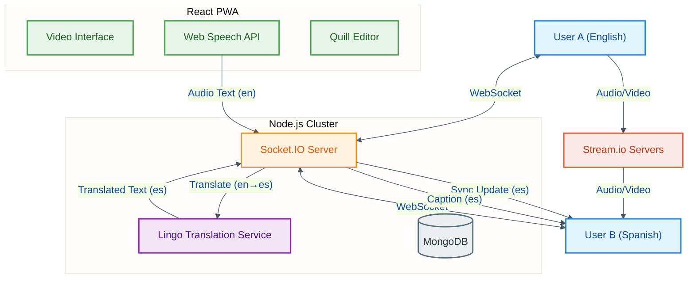

# 🌐 Meetio - Breaking Language Barriers in Real-Time

*Seamless Video Conferencing with Real-Time Translation*

**Meetio** is a next-generation video conferencing platform built to eliminate language barriers. By integrating real-time translation into every aspect of the meeting experience—chat, live captions, and collaborative notes—we ensure that every participant can communicate naturally in their own language.

## 📢 Project Demo

Check out the full project post here:  
👉 [View on X (Twitter)](https://x.com/AdiChhipa/status/2020392316197040380)


## 🚀 Key Features

### 🗣️ Real-Time Live Captions
Understanding accents and different languages can be difficult. Our system provides **live, translated captions** for every speaker.
- **Instant Translation:** Speak in Hindi, and a Spanish user sees Spanish captions.
- **Accent Handling:** Advanced speech recognition adapts to various accents to provide accurate text.
- **Accessibility:** Makes meetings inclusive for hearing-impaired users and non-native speakers.

### 💬 Multilingual Chat Translation
Never copy-paste into Google Translate again.
- **Auto-Translation:** Messages sent in the sender's language are instantly translated to the receiver's preferred language.
- **Seamless Experience:** Users see the chat in their native language, making cross-border collaboration effortless.

### 📝 Collaborative Translated Notes
Missing information during a meeting is a thing of the past.
- **Synced Editing:** Real-time collaborative editor (like Google Docs) for meeting minutes.
- **Personalized View:** The *same* note document is displayed in each user's selected language.
- **Zero Information Loss:** Changes are synchronized and translated instantly, ensuring everyone is on the same page—literally.

### 📹 Crystal Clear Video Calls
- **Low Latency:** Optimized video streaming for smooth communication.
- **Secure Sessions:** End-to-end encrypted signals for privacy.
- **Interactive:** Raise hand, screen sharing, and reaction features.

# 🏗️ System Architecture  

Our system handles **real-time streams for video, audio, and text** while orchestrating translation services dynamically.

# 📁 Project Structure

```text
talentiq/
|
├── backend/
|   ├── controllers/        # Business logic
|   ├── routes/             # API routes
|   ├── middleware/         # Auth & error middleware
|   ├── services/           # Translation & external services
|   ├── models/             # MongoDB schemas
|   ├── socket/             # Socket.IO event handlers
|   ├── config/             # DB and environment configs
|   └── server.js           # Backend entry point
|
├── frontend/
|   ├── src/
|   |   ├── components/     # UI components
|   |   ├── pages/          # App pages
|   |   ├── hooks/          # Custom React hooks
|   |   ├── context/        # Global state
|   |   ├── services/       # API & socket services
|   |   └── main.jsx        # Frontend entry point
|   └── vite.config.js
|
├── .env.example
└── README.md
```

---

## 🛠️ Technology Stack

- **Frontend:** React.js, TailwindCSS, DaisyUI, Vite
- **Backend:** Node.js, Express
- **Real-Time Communication:** Socket.IO
- **Video/Audio:** Stream.io SDK
- **Speech Recognition:** Web Speech API
- **Database:** MongoDB
- **Translation:** Custom Lingo Service Integration

## 🏁 Getting Started

### Prerequisites
- Node.js (v18+)
- MongoDB
- Stream.io API Key

### Installation

1. **Clone the repository**
   ```bash
   git clone https://github.com/yourusername/talentiq.git
   cd talentiq
   ```

2. **Install Dependencies**
   ```bash
   # Install root, backend, and frontend dependencies
   npm install
   cd backend && npm install
   cd ../frontend && npm install
   ```

3. **Environment Setup**
   Create `.env` files in `backend/` and `frontend/` directories following the `.env.example` template.

4. **Run the Application**
   ```bash
   # Start Backend (Port 5000)
   cd backend && npm start
   
   # Start Frontend (Port 5173)
   cd frontend && npm run dev
   ```

## 📄 License

This project is licensed under the **MIT License**.

```text
MIT License

Copyright (c) 2024 TalentIQ Team

Permission is hereby granted, free of charge, to any person obtaining a copy
of this software and associated documentation files (the "Software"), to deal
in the Software without restriction, including without limitation the rights
to use, copy, modify, merge, publish, distribute, sublicense, and/or sell
copies of the Software, and to permit persons to whom the Software is
furnished to do so, subject to the following conditions:

The above copyright notice and this permission notice shall be included in all
copies or substantial portions of the Software.

THE SOFTWARE IS PROVIDED "AS IS", WITHOUT WARRANTY OF ANY KIND, EXPRESS OR
IMPLIED, INCLUDING BUT NOT LIMITED TO THE WARRANTIES OF MERCHANTABILITY,
FITNESS FOR A PARTICULAR PURPOSE AND NONINFRINGEMENT. IN NO EVENT SHALL THE
AUTHORS OR COPYRIGHT HOLDERS BE LIABLE FOR ANY CLAIM, DAMAGES OR OTHER
LIABILITY, WHETHER IN AN ACTION OF CONTRACT, TORT OR OTHERWISE, ARISING FROM,
OUT OF OR IN CONNECTION WITH THE SOFTWARE OR THE USE OR OTHER DEALINGS IN THE
SOFTWARE.
```

---
*Built with ❤️ for the Hackathon*
